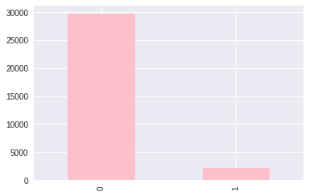
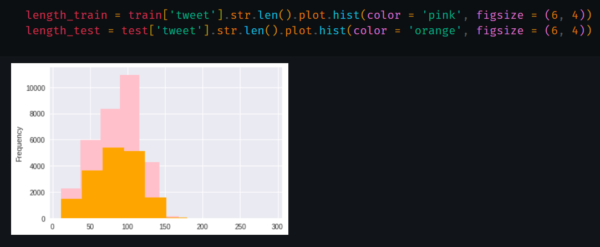
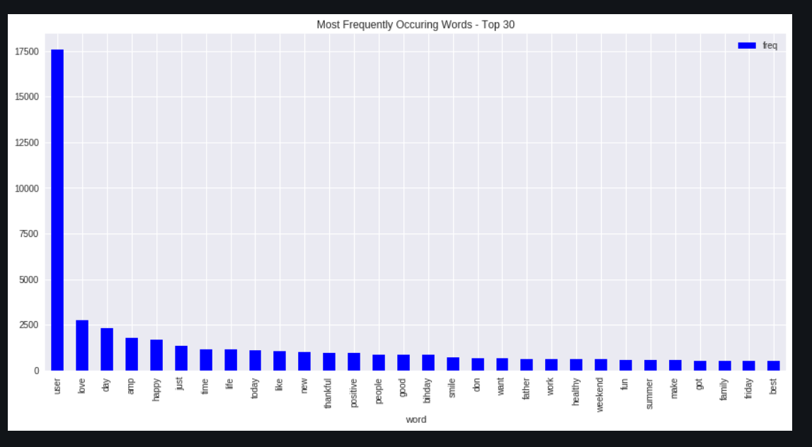
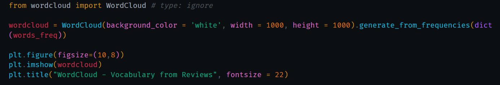
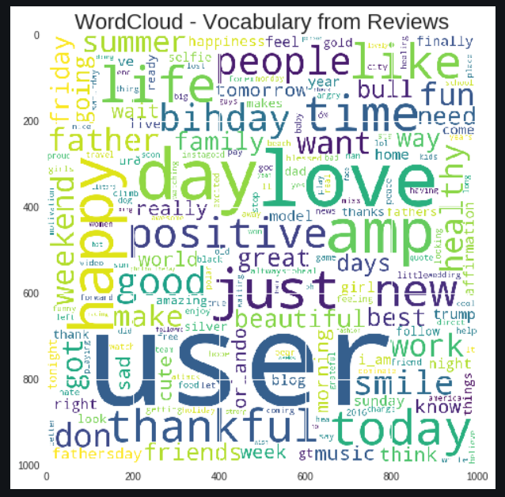
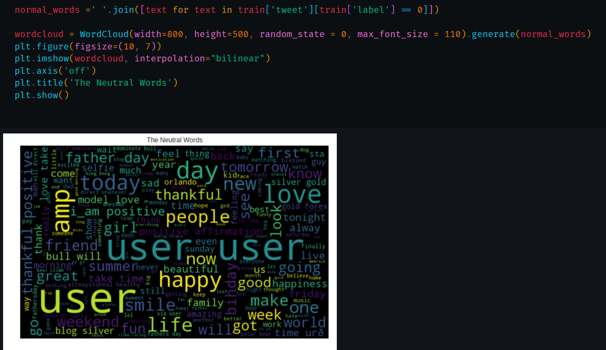
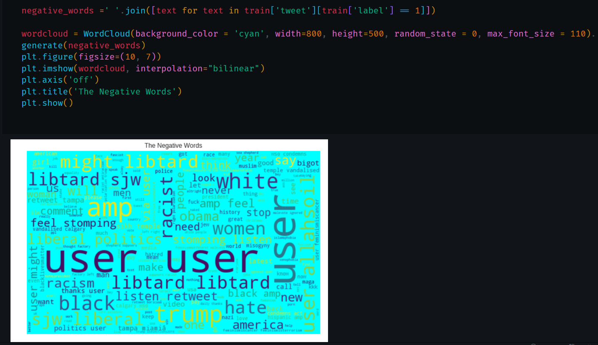
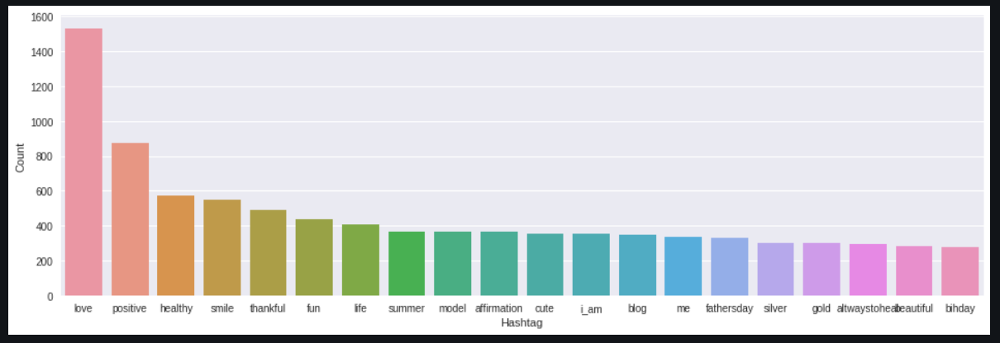
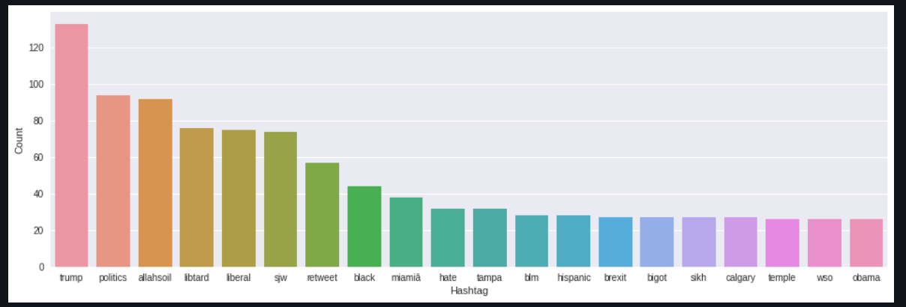

# Sentiment Analysis

Sentiment analysis can be a useful tool to understand public perception of a project on GitHub. Here's a quick rundown:

What it does: Analyzes tweets mentioning the project to measure overall sentiment (positive, negative, or neutral).

<h3>Claffication of Negative and Positive Tweets:</h3>

Here '0' represents Negative Tweets, and '1' represents Positive Tweets

<h3>Seeing how much our training data and testing data differs in length:</h3>

<h3>Top 30 most used words in the Test Data:</h3>

<h3>Visualisation of Vocabulary in the Tweets:</h3>

<h3>Visualisation of Normal Words:</h3>

<h3>Visualisation of Negative Words:</h3>

<h3>Here are the Top 'Positive' Hashtags used in the Tweets:</h3>

<h3>Here are the Top 'Negative' Hashtags used in the Tweets:</h3>

